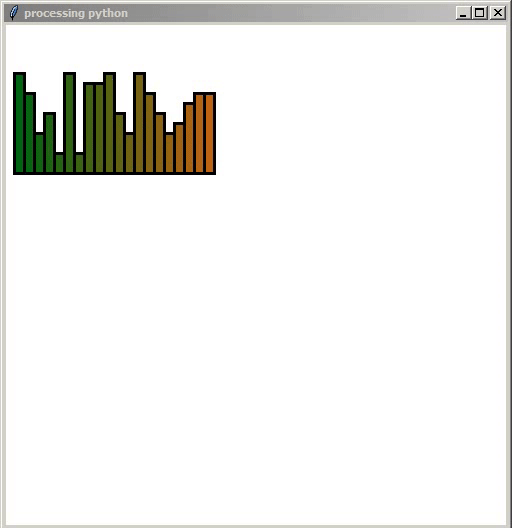
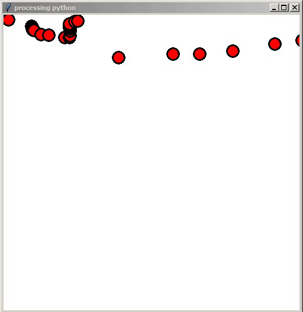

# ppython
Implementation of [processing.org](https://www.processing.org)'s processing in pure python (processing.py runs on jython, this one runs on **pure** python).

# Info

release name: omri

stability: alpha, highly volatile, more to be completed

# Running 

```
cd ppython/ppython
python ppython.py <path-to-file>/file.py
```

# History

Had this project around, removed it from the fossils graveyard when Dr. Omri Har-Shemesh came to our Python meetup, inspired by his high physics background, i was reminded of this in my cupboard and decided to open it to the world.

Please don't see the source code (ppython.py) else you'll chase me out of the Python kindom

# Why a pure python version?

To simply take advantage of the huge number of machine learning, data science and normal packages availble

# Dependencies

```python
>>> dependencies is None
True
```

Absolutely no dependency

# Gallery

Here are some snippets:

## Sound Bars

```
python ppython.py snippets/soundbars.py
```



code:

```python
def setup():
    pass

def draw():
    background(255, 255, 255)
    for i in range(20):
        ry = random(2, 10)*10
        fill(i*10, 100, 20)
        rect(10 + i*10, 150-ry, 10, ry)
        fill(255, 0, 0)
```

## Microsoft Logo

```
python ppython.py snippets/winlogo.py
```


code:

```python
def setup():
    size = 100
    noStroke()

    fill(245, 80, 35)
    rect(10, 10, size, size)

    fill(125, 185, 0)
    rect(120, 10, size, size)

    fill(0, 160, 240)
    rect(10, 120, size, size)

    fill(255, 185, 0)
    rect(120, 120, size, size)

def draw():
    pass
```

## Paint

```
python ppython.py snippets/paint.py
```



code:

```python
def setup():
    pass

def draw():
    fill(255, 0, 0)
    ellipse(mouseX, mouseY, 20, 20)
```

## Line Graph

```
python ppython.py snippets/line_graph.py
```


code:

```python
coords = [
    (20, 30),
    (50, 35),
    (80, 40),
    (110, 50),
    (130, 70),
    (150, 90),
    (180, 110),
    (210, 120),
    (240, 150),
    (270, 200)
]

def setup():
    global coords
    noStroke()
    for coord in coords:
        x = coord[0]; y = coord[1]
        fill(255, 175, 150)
        ellipse(x-5, y-5, 10, 10)
    stroke(255, 175, 150)
    strokeSize(3)
    for i, coord in enumerate(coords):
        if i+1 < len(coords):
            x = coord[0]; y = coord[1]
            x2 = coords[i+1][0]; y2 = coords[i+1][1]
            line(x, y, x2, y2)

def draw():
    pass
```

## Brownian Motion

```
python ppython.py snippets/brownian_motion.py
```


code:

```python
class Particle:
    def __init__(self, x, y, r=10, vx=1, vy=1, randv=False):
        self.x = x
        self.y = y
        self.r = r
        self.vx = vx
        self.vy = vy

        if randv:
            rand1 = random(0, 1)
            rand2 = random(0, 1)
            if rand1:
                self.vx *= -1
            if rand2:
                self.vy *= -1


    def draw(self):
        noStroke()
        fill(140,70,20)
        ellipse(self.x, self.y, self.r, self.r)

    def update(self):
        self.x += self.vx
        self.y += self.vy

    def check_bounds(self):
        global width
        if self.x > width-self.r or self.x-self.r < 0:
            self.vx *= -1
        if self.y > height-self.r or self.y-self.r < 0:
            self.vy *= -1

    def run(self):
        self.update()
        self.check_bounds()
        self.draw()

particles = [Particle(
                random(0, width), random(0, width), vx=2, vy=2, randv=True) 
            for i in range(200)]
def setup():
    pass

def draw():
    global particles
    background(255, 255, 255)
    for p in particles:
        p.run()
```

# Docs

- setup()

used to initialise what will be used only once

- draw()

code to be looped is placed in it

- line()

```python
line(x1, y1, x2, y2)
```

- rect()

```python
rect(x, y, width, height)
```

- ellipse()

```python
ellipse(x, y, width, height)
```

- background()

```python
background(r, g, b)
```

- fill()

```python
fill(r, g, b)
```

used to colour shapes

- stroke()

```python
stroke(r, g, b)
```

used to colour lines and boarders of shapes

- strokeSize()

```python
strokeSize(thickness)
```

used to define borders of shapes

- noFill()

```python
noFill()
```

removes filling

- noStroke()

```python
noStroke()
```

removes strokes

- random()

```python
random(start, end)
```

returns integer inclusive of start, exclusive of end